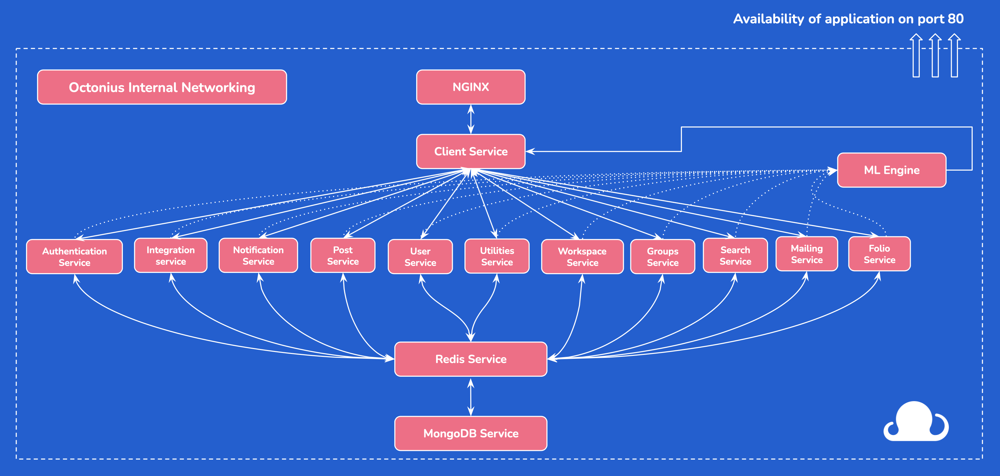

<div align="center">

# 🐙 Octonius App

### Enterprise-Grade Microservices Platform for Team Collaboration

[](https://www.typescriptlang.org/)
[](https://angular.io/)
[](https://nodejs.org/)
[](https://www.mongodb.com/)
[](https://www.docker.com/)
[](https://redis.io/)
[](https://min.io/)
[](https://nginx.org/)

---

*A fully containerized, microservices-based collaboration platform with 16 independent services, multi-language support, and enterprise deployment capabilities.*

**9,395+ Commits** • **16 Microservices** • **Multi-Language Support**

</div>

---

## 📋 Table of Contents

- [Overview](#-overview)
- [Architecture](#-architecture)
- [Technology Stack](#-technology-stack)
- [Microservices](#-microservices)
- [Project Structure](#-project-structure)
- [Quick Start](#-quick-start)
- [Development](#-development)
- [Deployment](#-deployment)
- [API Reference](#-api-reference)
- [Contribution Guidelines](#-contribution-guidelines)
- [Server Administration](#-server-administration)
- [License](#-license)

---

## 🎯 Overview

**Octonius App** is a comprehensive enterprise collaboration platform built on a microservices architecture. It provides teams with tools for workspaces, groups, posts, chats, approvals, file management, and more—all orchestrated through Docker containers and managed via Nginx reverse proxy.

### Key Highlights

- 🏗️ **16 Independent Microservices** - Fully decoupled, scalable architecture
- 🌍 **Multi-Language Support** - English, German, Spanish, Farsi, Hungarian, Turkish
- 🐳 **Full Docker Orchestration** - Docker Compose & Docker Swarm ready
- 📁 **MinIO Integration** - S3-compatible object storage
- 🔐 **LDAP Authentication** - Enterprise SSO support
- 📄 **LibreOffice Server** - Document processing and conversion
- ⚡ **Real-time Features** - WebSocket & Socket.io integration
- 🔄 **CI/CD Pipeline** - Bitbucket Pipelines automation

---

## 🏗 Architecture

<div align="center">



*Complete microservices architecture diagram showing all service interactions*

</div>

---

<div align="center">

### Database Schema Documentation

[](https://www.mongodb.com/)
[](https://mongoosejs.com/)

---

</div>

The Octonius App uses **MongoDB** as its primary database with **Mongoose** as the ODM (Object Document Mapper). The database follows a **multi-tenant architecture** where:

- **Account** represents a person's global identity (can belong to multiple workspaces)
- **User** represents a person's identity within a specific workspace
- **Workspace** is the tenant/organization boundary

### Database Statistics

| Metric | Value |
|--------|-------|
| **Total Entities** | 18+ |
| **Core Entities** | 5 |
| **Collaboration Entities** | 8 |
| **CRM Entities** | 3 |
| **Supporting Entities** | 5+ |

---

## 📊 Entity Relationship Diagram

```
┌─────────────────────────────────────────────────────────────────────────────────────┐
│                              OCTONIUS DATABASE SCHEMA                               │
├─────────────────────────────────────────────────────────────────────────────────────┤
│                                                                                     │
│  ┌─────────────┐           ┌─────────────────┐           ┌─────────────────┐        │
│  │   ACCOUNT   │──────────▶│      USER       │◀──────────│   WORKSPACE     │        │
│  │             │ 1      N  │                 │  N      1 │                 │        │
│  │ _id         │           │ _id             │           │ _id             │        │
│  │ email       │           │ _account ───────┼──────────▶│ workspace_name  │        │
│  │ password    │           │ _workspace ─────┼──────────▶│ access_code     │        │
│  │ _workspaces │           │ first_name      │           │ _owner ─────────┼───┐    │
│  │ ssoType     │           │ last_name       │           │ members[]       │   │    │
│  └─────────────┘           │ email           │           │ allowed_domains │   │    │
│                            │ role            │           │ integrations    │   │    │
│                            │ _groups[] ──────┼──┐        └─────────────────┘   │    │
│                            │ integrations    │  │                              │    │
│                            │ hr              │  │                              │    │
│                            │ stats           │  │        ┌─────────────────┐   │    │
│                            └─────────────────┘  │        │   COLLECTION    │   │    │
│                                   │             │        │                 │   │    │
│                                   │             │        │ _id             │   │    │
│                                   ▼             │        │ name            │   │    │
│  ┌─────────────────┐      ┌─────────────────┐   │        │ _workspace      │   │    │
│  │    PORTFOLIO    │      │      GROUP      │ ◀─┘        │ _groups[]       │   │    │
│  │                 │      │                 │            └─────────────────┘   │    │
│  │ _id             │      │ _id             │                                  │    │
│  │ name            │      │ group_name      │ ◀────────────────────────────────┘    │
│  │ _workspace      │      │ _workspace  ────┼────────────────────────────────────── │
│  │ _groups[]       │      │ _members[]  ────┼─────────────┐                         │
│  │ _collections[]  │      │ _admins[]       │             │                         │
│  └─────────────────┘      │ custom_fields   │             ▼                         │
│          │                │ type            │      ┌─────────────────┐              │
│          │                │ conditions      │      │      POST       │              │
│          ▼                └─────────────────┘      │                 │              │
│  ┌─────────────────┐              │                │ _id             │              │
│  │    RESOURCE     │              │                │ title           │              │
│  │                 │              │                │ content         │              │
│  │ _id             │              ▼                │ type            │              │
│  │ name            │      ┌─────────────────┐      │ _group  ────────┼───────────── ┤
│  │ _group          │      │     COLUMN      │      │ _posted_by      │              │
│  │ custom_fields   │      │                 │      │ comments[]      │              │
│  └─────────────────┘      │ _id             │      │ task{}          │              │
│                           │ name            │      │ crm{}           │              │
│                           │ _group ─────────┼──────│ approval_flow[] │              │
│                           │ _posts[]        │      └─────────────────┘              │
│                           │ position        │              │                        │
│                           └─────────────────┘              │                        │
│                                                            ▼                        │
│  ┌─────────────────┐      ┌─────────────────┐      ┌─────────────────┐              │
│  │     COMPANY     │      │     CONTACT     │      │    COMMENT      │              │
│  │                 │      │                 │      │                 │              │
│  │ _id             │      │ _id             │      │ _id             │              │
│  │ name            │◀─────│ _company        │      │ content         │              │
│  │ _group          │      │ name            │      │ _post           │              │
│  │ custom_fields   │      │ email           │      │ _posted_by      │              │
│  └─────────────────┘      │ _group          │      │ created_date    │              │
│          │                └─────────────────┘      └─────────────────┘              │
│          │                                                                          │
│          ▼                                                                          │
│  ┌─────────────────┐      ┌─────────────────┐      ┌─────────────────┐              │
│  │     PRODUCT     │      │      CHAT       │      │  NOTIFICATION   │              │
│  │                 │      │                 │      │                 │              │
│  │ _id             │      │ _id             │      │ _id             │              │
│  │ name            │      │ _members[]      │      │ type            │              │
│  │ _company        │      │ _group          │      │ _user           │              │
│  │ price           │      │ messages[]      │      │ message         │              │
│  └─────────────────┘      └─────────────────┘      │ read            │              │
│                                   │                └─────────────────┘              │
│                                   ▼                                                 │
│                           ┌─────────────────┐      ┌─────────────────┐              │
│                           │    MESSAGE      │      │      PAGE       │              │
│                           │                 │      │                 │              │
│                           │ _id             │      │ _id             │              │
│                           │ content         │      │ name            │              │
│                           │ _chat           │      │ content         │              │
│                           │ _sender         │      │ _group          │              │
│                           │ created_date    │      │ _created_by     │              │
│                           └─────────────────┘      └─────────────────┘              │
│                                                                                     │
│  ┌─────────────────┐      ┌─────────────────┐      ┌─────────────────┐              │
│  │      FLOW       │      │     STORY       │      │  TIME_TRACKING  │              │
│  │                 │      │                 │      │                 │              │
│  │ _id             │      │ _id             │      │ _id             │              │
│  │ name            │      │ title           │      │ _user           │              │
│  │ _group          │      │ _group          │      │ _post           │              │
│  │ steps[]         │      │ _created_by     │      │ hours           │              │
│  └─────────────────┘      └─────────────────┘      │ date            │              │
│                                                    └─────────────────┘              │
│                                                                                     │
└─────────────────────────────────────────────────────────────────────────────────────┘

LEGEND:
────────────────────────────────────────────────────────────
─────────▶  One-to-Many Relationship
◀─────────  Many-to-One Relationship  
[]         Array of References
{}         Embedded Document
```

---

## 🏗 Core Entities

### 1. Account

The global identity of a user across all workspaces.

```typescript
Account {
  _id: ObjectId                    // Primary key
  email: String                    // Unique, required
  password: String                 // Hashed password (optional for SSO)
  _workspaces: ObjectId[]          // References to Workspace
  first_name: String               // Required
  last_name: String                // Required
  ssoType: Enum                    // 'AD' | 'GOOGLE' | 'LDAP'
  created_date: Date               // Default: DateTime.now()
}
```

**Relationships:**
- `1:N` → **User** (One account can have many user profiles)
- `N:M` → **Workspace** (Account belongs to many workspaces)

---

### 2. User

A user's profile within a specific workspace.

```typescript
User {
  _id: ObjectId                    // Primary key
  _account: ObjectId               // Reference to Account (required)
  _workspace: ObjectId             // Reference to Workspace
  
  // Profile Information
  first_name: String               // Required
  last_name: String                // Required
  full_name: String                // Required, lowercase
  email: String                    // Optional
  profile_pic: String              // Default: 'assets/images/user.png'
  workspace_name: String           // Required
  
  // Role & Permissions
  role: Enum                       // 'owner' | 'member' | 'admin' | 'manager' | 'guest'
  hr_role: Boolean                 // Default: false
  crm_role: Boolean                // Default: false
  
  // Professional Details
  phone_number: String
  mobile_number: String
  current_position: String
  bio: String
  company_name: String
  company_join_date: Date
  skills: String[]
  
  // Groups & Favorites
  _groups: ObjectId[]              // References to Group
  _private_group: ObjectId         // Reference to Group
  
  // HR Information
  hr: {
    _entity: ObjectId              // Reference to Entity
    entity_custom_fields: Map
    address_line_1: String
    city: String
    country: String
    hourly_rate: Number
  }
  
  // Statistics & Preferences
  stats: {
    lastTaskView: String           // Default: 'kanban'
    favorite_groups: ObjectId[]
    favorite_portfolios: ObjectId[]
    favorite_collections: ObjectId[]
    locale: Enum                   // 'en' | 'de' | 'es' | 'fa' | 'hu' | 'tr'
  }
  
  // Third-party Integrations
  integrations: {
    firebase_token: String
    gdrive: { token: String }
    slack: { token: String, team_id: String }
    teams: { user_id: String, tenant_id: String }
    ms_365: { enabled: Boolean, token: String }
  }
  
  // Dashboard Widgets
  selected_widgets: String[]       // WORK_STATISTICS, WORKLOAD, VELOCITY, etc.
  
  created_date: Date
}
```

**Relationships:**
- `N:1` → **Account** (Many users belong to one account)
- `N:1` → **Workspace** (User belongs to one workspace)
- `N:M` → **Group** (User belongs to many groups)

---

### 3. Workspace

The tenant/organization boundary.

```typescript
Workspace {
  _id: ObjectId                    // Primary key
  workspace_name: String           // Required
  company_name: String
  access_code: String              // Unique, required
  workspace_avatar: String         // Default: 'assets/images/organization.png'
  
  // Ownership
  owner_email: String              // Required
  owner_first_name: String         // Required
  owner_last_name: String          // Required
  _owner: ObjectId                 // Reference to User
  
  // Members
  members: ObjectId[]              // References to User
  allowed_domains: String[]        // Email domain restrictions
  invited_users: [{
    email: String
    invited_date: Date
    type: Enum                     // 'group' | 'workspace'
    _group: ObjectId
  }]
  
  // Custom Fields
  profile_custom_fields: [{
    name: String
    title: String
    values: String[]
    user_type: Boolean
  }]
  
  // CRM Configuration
  crm_custom_fields: [{
    name: String
    title: String
    type: Enum                     // 'contact' | 'company' | 'product'
    values: String[]
  }]
  
  // Integrations
  integrations: {
    // Google
    is_google_connected: Boolean
    google_client_id: String
    google_client_secret_key: String
    
    // Slack
    is_slack_connected: Boolean
    slack_client_id: String
    
    // Azure AD
    is_azure_ad_connected: Boolean
    azure_ad_clientId: String
    
    // LDAP
    is_ldap_connected: Boolean
    ldap_url: String
    ldap_dn: String
    
    // Microsoft 365
    is_ms_365_connected: Boolean
    ms_365_client_id: String
    ms_365_tenant_id: String
    
    // Box, OneDrive, Atlassian
    is_box_connected: Boolean
    is_onedrive_connected: Boolean
    is_atlassia_connected: Boolean
  }
  
  management_private_api_key: String
  created_date: Date
}
```

**Relationships:**
- `1:N` → **User** (Workspace has many users)
- `1:N` → **Group** (Workspace has many groups)
- `1:1` → **User** (Workspace has one owner)

---

### 4. Group

Teams/projects within a workspace.

```typescript
Group {
  _id: ObjectId                    // Primary key
  group_name: String               // Required, trimmed
  group_avatar: String             // Default: 'assets/images/icon-new-group.svg'
  archived_group: Boolean          // Default: false
  
  // Workspace Association
  workspace_name: String           // Required
  _workspace: ObjectId             // Reference to Workspace (required)
  
  // Members
  _members: ObjectId[]             // References to User
  _admins: ObjectId[]              // References to User
  members_fares: Map<String, Number>
  members_count: Number            // Default: 0
  
  // Type Configuration
  type: Enum                       // 'normal' | 'agora' | 'crm' | 'accounting' | 'resource'
  project_type: Boolean            // Default: false
  project_status: Enum             // 'ON TRACK' | 'NOT STARTED' | 'IN DANGER' | 'ACHIEVED'
  shuttle_type: Boolean            // Default: false
  _shuttle_section: ObjectId       // Reference to Column
  
  // Features & Settings
  enabled_rights: Boolean          // Default: false
  enabled_campaign: Boolean        // Default: false
  freeze_dates: Boolean            // Default: false
  keep_pinned_open: Boolean        // Default: false
  share_files: Boolean             // Default: false
  files_for_admins: Boolean        // Default: false
  
  // Appearance
  background_color: String
  background_image: String
  description: String
  pulse_description: String
  
  // Custom Fields
  custom_fields: [{
    name: String                   // Required
    title: String                  // Required
    input_type: Boolean
    input_type_number: Boolean
    input_type_text: Boolean
    input_type_date: Boolean
    values: String[]
    display_in_kanban_card: Boolean
    badge_color: String            // Default: '#e4edf8'
  }]
  
  files_custom_fields: [...]       // Same structure as custom_fields
  resources_custom_fields: [...]   // Same structure as custom_fields
  crm_custom_fields: [...]         // Same structure with 'type' enum
  
  // Time Tracking
  time_tracking_categories: [{
    name: String
  }]
  
  // Dashboard Configuration
  selected_widgets: String[]       // WORK_STATISTICS, WORKLOAD, etc.
  pages_to_show: {
    activity: Boolean
    tasks: Boolean
    files: Boolean
    library: Boolean
    members: Boolean
    resource_management: Boolean
    dashboard: Boolean
  }
  
  // Dialog Properties
  dialog_properties_to_show: {
    task: String[]
    normal: String[]
    event: String[]
    northStar: String[]
    CRMOrder: String[]
    CRMLead: String[]
  }
  
  // Conditions for Auto-Join
  conditions: {
    email_domains: String[]
    job_positions: String[]
    skills: String[]
    custom_fields: [{ name: String, value: String }]
  }
  
  // RAG Tags (Risk Assessment)
  rags: [{
    rag_tag: String
    _members: ObjectId[]
  }]
  
  // Records & History
  records: {
    pulses: [{ date: Date, description: String }]
    status: [{ date: Date, project_status: String }]
    done_tasks_count: [{ date: Date, count: Number }]
  }
  
  files: String[]
  created_date: Date
}
```

**Relationships:**
- `N:1` → **Workspace** (Group belongs to one workspace)
- `N:M` → **User** (Group has many members/admins)
- `1:N` → **Column** (Group has many columns)
- `1:N` → **Post** (Group has many posts)
- `1:N` → **Chat** (Group has many chats)

---

### 5. Post

Content items (tasks, events, documents, etc.).

```typescript
Post {
  _id: ObjectId                    // Primary key
  
  // Content
  title: String                    // Trimmed
  content: String                  // Trimmed
  _content_mentions: ObjectId[]    // References to User (mixed type)
  type: Enum                       // Required: 'normal' | 'event' | 'task' | 'performance_task' | 'document'
  
  // Association
  _group: ObjectId                 // Reference to Group
  _posted_by: ObjectId             // Reference to User (required)
  
  // Engagement
  likes_count: Number              // Default: 0
  _liked_by: ObjectId[]            // References to User
  pin_to_top: Boolean              // Default: false
  
  // Comments
  comments_count: Number           // Default: 0
  comments: ObjectId[]             // References to Comment
  
  // Permissions
  permissions: [{
    right: Enum                    // 'view' | 'edit' | 'hide'
    rags: Mixed[]
    _members: ObjectId[]           // References to User
  }]
  
  // Files & Tags
  files: [{
    original_name: String
    modified_name: String
  }]
  tags: String[]
  
  // Read Tracking
  read_count: Number               // Default: 0
  _read_by: ObjectId[]             // References to User
  
  // Followers
  followers_count: Number          // Default: 0
  _followers: ObjectId[]           // References to User
  
  // Assignment
  _assigned_to: ObjectId[]         // References to User
  archived: Boolean                // Default: false
  
  // Recurrence
  is_recurrent: Boolean            // Default: false
  recurrent: {
    frequency: Enum                // 'daily' | 'weekly' | 'monthly' | 'yearly' | 'custom' | 'periodically'
    _parent_post: ObjectId         // Reference to Post
    end_date: Date
    days_of_week: Number[]         // 1-7 (Monday-Sunday)
    recurrency_on: Date
    specific_days: Date[]
  }
  
  // Approval Workflow
  approval_active: Boolean         // Default: false
  approval_flow_launched: Boolean  // Default: false
  approval_due_date: Date
  approval_envelope: String
  approval_flow: [{
    _assigned_to: ObjectId         // Reference to User (required)
    confirmation_code: String
    confirmed: Boolean             // Default: false
    confirmation_date: Date
    signature_code: String
    description: String
  }]
  approval_history: [{
    _actor: ObjectId               // Reference to User (required)
    description: String
    action: Enum                   // 'created' | 'deleted' | 'launch' | 'rejected' | 'approved'
    approval_date: Date
  }]
  
  // CRM Integration
  crm: {
    _company: ObjectId             // Reference to Company
    _contacts: ObjectId[]          // References to Contact
    orders: [{
      _product: ObjectId           // Reference to Product
      quantity: Number
      crm_custom_fields: Map<String, String>
    }]
  }
  
  // Activity Logs
  logs: [{
    action: Enum                   // 'created' | 'change_status' | 'assigned_to' | etc. (30+ actions)
    _actor: ObjectId               // Reference to User (required)
    action_date: Date
    new_status: String
    _new_section: ObjectId         // Reference to Column
    _assignee: ObjectId            // Reference to User
    _group: ObjectId               // Reference to Group
    _task: ObjectId                // Reference to Post
    allocation: Number
    estimation: { hours: String, minutes: String }
  }]
  
  // Task-Specific Fields
  task: {
    due_to: Date
    status: String                 // Default: 'to do'
    completed_at: Date
    _column: ObjectId              // Reference to Column
    allocation: Number             // Default: 0
    estimation: { hours: String, minutes: String }
    custom_fields: Map<String, String>
    
    // Task Types
    isNorthStar: Boolean           // Default: false
    is_idea: Boolean               // Default: false
    is_milestone: Boolean          // Default: false
    is_crm_task: Boolean           // Default: false
    is_crm_order: Boolean          // Default: false
    
    // North Star
    northStar: {
      target_value: Number         // Default: 0
      values: [{
        date: Date
        value: Number
        status: Enum               // 'NOT STARTED' | 'ON TRACK' | 'IN DANGER' | 'ACHIEVED'
        _user: ObjectId
      }]
      type: Enum                   // 'Currency' | 'Percent' | 'Number'
      currency: String
      header_background_color: String
    }
    
    // Idea Voting
    idea: {
      negative_votes: String[]
      positive_votes: String[]
    }
    
    // Dependencies
    start_date: Date
    _parent_task: ObjectId         // Reference to Post
    _dependency_task: ObjectId[]   // References to Post
    _dependent_child: ObjectId[]   // References to Post
    
    // Templates
    is_template: Boolean           // Default: false
    template_name: String
    
    // Shuttle (Cross-Group Tasks)
    shuttle_type: Boolean          // Default: false
    shuttles: [{
      _shuttle_group: ObjectId     // Reference to Group
      _shuttle_section: ObjectId   // Reference to Column
      shuttle_status: String       // Default: 'to do'
      shuttled_at: Date
    }]
  }
  
  // Performance Task
  performance_task: {
    _assigned_to: ObjectId         // Reference to User
    skills: String[]
    status: Enum                   // 'to do' | 'in progress' | 'done'
    completed_at: Date
  }
  
  // Event
  event: {
    due_to: String
  }
  
  created_date: Date
}
```

**Relationships:**
- `N:1` → **Group** (Post belongs to one group)
- `N:1` → **User** (Post has one author)
- `N:M` → **User** (Post has many assignees/followers)
- `1:N` → **Comment** (Post has many comments)
- `N:1` → **Column** (Task belongs to one column)
- `N:1` → **Post** (Task has parent task)
- `N:M` → **Post** (Task has dependencies)

---

## 🤝 Collaboration Entities

### 6. Column

Kanban board columns for task organization.

```typescript
Column {
  _id: ObjectId                    // Primary key
  name: String                     // Required
  _group: ObjectId                 // Reference to Group (required)
  _posts: ObjectId[]               // References to Post
  position: Number                 // Order position
  color: String                    // Column color
  archived: Boolean                // Default: false
  created_date: Date
}
```

### 7. Comment

Comments on posts.

```typescript
Comment {
  _id: ObjectId                    // Primary key
  content: String                  // Required
  _post: ObjectId                  // Reference to Post (required)
  _posted_by: ObjectId             // Reference to User (required)
  _mentions: ObjectId[]            // References to User
  likes_count: Number              // Default: 0
  _liked_by: ObjectId[]            // References to User
  created_date: Date
  updated_date: Date
}
```

### 8. Chat

Chat rooms for real-time messaging.

```typescript
Chat {
  _id: ObjectId                    // Primary key
  name: String                     // Optional
  type: Enum                       // 'direct' | 'group'
  _members: ObjectId[]             // References to User
  _group: ObjectId                 // Reference to Group (optional)
  _workspace: ObjectId             // Reference to Workspace
  last_message: ObjectId           // Reference to Message
  created_date: Date
}
```

### 9. Message

Chat messages.

```typescript
Message {
  _id: ObjectId                    // Primary key
  content: String                  // Required
  _chat: ObjectId                  // Reference to Chat (required)
  _sender: ObjectId                // Reference to User (required)
  _mentions: ObjectId[]            // References to User
  read_by: ObjectId[]              // References to User
  files: [{
    original_name: String
    modified_name: String
  }]
  created_date: Date
}
```

### 10. Notification

System notifications.

```typescript
Notification {
  _id: ObjectId                    // Primary key
  type: String                     // Notification type
  _user: ObjectId                  // Reference to User (required)
  _actor: ObjectId                 // Reference to User (who triggered)
  message: String
  data: {
    _post: ObjectId
    _group: ObjectId
    _comment: ObjectId
  }
  read: Boolean                    // Default: false
  created_date: Date
}
```

### 11. Portfolio

Portfolio collections of groups.

```typescript
Portfolio {
  _id: ObjectId                    // Primary key
  name: String                     // Required
  _workspace: ObjectId             // Reference to Workspace (required)
  _created_by: ObjectId            // Reference to User
  _groups: ObjectId[]              // References to Group
  _collections: ObjectId[]         // References to Collection
  description: String
  created_date: Date
}
```

### 12. Collection

Collections within portfolios.

```typescript
Collection {
  _id: ObjectId                    // Primary key
  name: String                     // Required
  _workspace: ObjectId             // Reference to Workspace (required)
  _created_by: ObjectId            // Reference to User
  _groups: ObjectId[]              // References to Group
  description: String
  created_date: Date
}
```

### 13. Page

Wiki/documentation pages.

```typescript
Page {
  _id: ObjectId                    // Primary key
  name: String                     // Required
  content: String                  // Rich text content
  _group: ObjectId                 // Reference to Group
  _workspace: ObjectId             // Reference to Workspace
  _created_by: ObjectId            // Reference to User
  _parent_page: ObjectId           // Reference to Page (for hierarchy)
  position: Number
  created_date: Date
  updated_date: Date
}
```

---

## 💼 CRM Entities

### 14. Company

CRM company records.

```typescript
Company {
  _id: ObjectId                    // Primary key
  name: String                     // Required
  _group: ObjectId                 // Reference to Group
  _workspace: ObjectId             // Reference to Workspace
  _created_by: ObjectId            // Reference to User
  
  // Company Details
  industry: String
  website: String
  address: String
  city: String
  country: String
  
  // Custom Fields
  custom_fields: Map<String, String>
  
  // Relationships
  _contacts: ObjectId[]            // References to Contact
  _products: ObjectId[]            // References to Product
  
  created_date: Date
}
```

### 15. Contact

CRM contact records.

```typescript
Contact {
  _id: ObjectId                    // Primary key
  name: String                     // Required
  email: String
  phone: String
  position: String
  
  _company: ObjectId               // Reference to Company
  _group: ObjectId                 // Reference to Group
  _workspace: ObjectId             // Reference to Workspace
  _created_by: ObjectId            // Reference to User
  
  // Custom Fields
  custom_fields: Map<String, String>
  
  created_date: Date
}
```

### 16. Product

CRM product records.

```typescript
Product {
  _id: ObjectId                    // Primary key
  name: String                     // Required
  price: Number
  description: String
  sku: String
  
  _company: ObjectId               // Reference to Company
  _group: ObjectId                 // Reference to Group
  _workspace: ObjectId             // Reference to Workspace
  _created_by: ObjectId            // Reference to User
  
  // Custom Fields
  custom_fields: Map<String, String>
  
  created_date: Date
}
```

---

## 🔧 Supporting Entities

### 17. Flow

Workflow automation definitions.

```typescript
Flow {
  _id: ObjectId                    // Primary key
  name: String                     // Required
  _group: ObjectId                 // Reference to Group
  _workspace: ObjectId             // Reference to Workspace
  _created_by: ObjectId            // Reference to User
  
  steps: [{
    type: Enum                     // 'condition' | 'action' | 'notification'
    config: Mixed
    next_step: ObjectId
  }]
  
  trigger: {
    type: Enum                     // 'status_change' | 'date' | 'manual'
    config: Mixed
  }
  
  active: Boolean                  // Default: true
  created_date: Date
}
```

### 18. Resource

Resource management entities.

```typescript
Resource {
  _id: ObjectId                    // Primary key
  name: String                     // Required
  _group: ObjectId                 // Reference to Group
  _workspace: ObjectId             // Reference to Workspace
  _created_by: ObjectId            // Reference to User
  
  type: String
  custom_fields: Map<String, String>
  
  created_date: Date
}
```

### 19. TimeTrackingEntity

HR/Time tracking entities.

```typescript
TimeTrackingEntity {
  _id: ObjectId                    // Primary key
  _user: ObjectId                  // Reference to User
  _post: ObjectId                  // Reference to Post
  _group: ObjectId                 // Reference to Group
  
  hours: Number
  minutes: Number
  category: String
  description: String
  date: Date
  
  created_date: Date
}
```

### 20. Story

Story/changelog entries.

```typescript
Story {
  _id: ObjectId                    // Primary key
  title: String
  content: String
  _group: ObjectId                 // Reference to Group
  _workspace: ObjectId             // Reference to Workspace
  _created_by: ObjectId            // Reference to User
  
  files: String[]
  created_date: Date
}
```

### 21. ResetPassword

Password reset tokens.

```typescript
ResetPassword {
  _id: ObjectId                    // Primary key
  email: String                    // Required
  token: String                    // Unique, required
  expires: Date                    // Expiration date
  created_date: Date
}
```

---

## 🔗 Relationship Summary

### One-to-Many Relationships

| Parent Entity | Child Entity | Foreign Key |
|--------------|--------------|-------------|
| Account | User | `_account` |
| Workspace | User | `_workspace` |
| Workspace | Group | `_workspace` |
| Group | Post | `_group` |
| Group | Column | `_group` |
| Group | Chat | `_group` |
| Group | Page | `_group` |
| Group | Resource | `_group` |
| Post | Comment | `_post` |
| Chat | Message | `_chat` |
| Company | Contact | `_company` |
| Company | Product | `_company` |

### Many-to-Many Relationships

| Entity 1 | Entity 2 | Implementation |
|----------|----------|----------------|
| User | Group | Array `_groups[]` in User, `_members[]` in Group |
| User | Post | Array `_assigned_to[]` in Post |
| Post | Post | Array `_dependency_task[]`, `_dependent_child[]` |
| Portfolio | Group | Array `_groups[]` |
| Collection | Group | Array `_groups[]` |

### Self-Referencing Relationships

| Entity | Relationship | Field |
|--------|--------------|-------|
| Post | Parent-Child | `_parent_task` |
| Page | Hierarchy | `_parent_page` |
| Post | Recurrence | `recurrent._parent_post` |

---

## ⚡ Indexes & Performance

### Recommended Indexes

```javascript
// Account
db.accounts.createIndex({ "email": 1 }, { unique: true })

// User
db.users.createIndex({ "_account": 1 })
db.users.createIndex({ "_workspace": 1 })
db.users.createIndex({ "email": 1 })
db.users.createIndex({ "_groups": 1 })
db.users.createIndex({ "full_name": "text" })

// Workspace
db.workspaces.createIndex({ "access_code": 1 }, { unique: true })
db.workspaces.createIndex({ "workspace_name": 1 })

// Group
db.groups.createIndex({ "_workspace": 1 })
db.groups.createIndex({ "group_name": "text" })
db.groups.createIndex({ "_members": 1 })

// Post
db.posts.createIndex({ "_group": 1 })
db.posts.createIndex({ "_posted_by": 1 })
db.posts.createIndex({ "type": 1 })
db.posts.createIndex({ "task.status": 1 })
db.posts.createIndex({ "task.due_to": 1 })
db.posts.createIndex({ "task._column": 1 })
db.posts.createIndex({ "_assigned_to": 1 })
db.posts.createIndex({ "created_date": -1 })
db.posts.createIndex({ "title": "text", "content": "text" })

// Column
db.columns.createIndex({ "_group": 1 })
db.columns.createIndex({ "position": 1 })

// Comment
db.comments.createIndex({ "_post": 1 })
db.comments.createIndex({ "_posted_by": 1 })

// Chat
db.chats.createIndex({ "_members": 1 })
db.chats.createIndex({ "_workspace": 1 })

// Message
db.messages.createIndex({ "_chat": 1 })
db.messages.createIndex({ "created_date": -1 })

// Notification
db.notifications.createIndex({ "_user": 1 })
db.notifications.createIndex({ "read": 1 })
db.notifications.createIndex({ "created_date": -1 })
```

### Compound Indexes

```javascript
// For dashboard queries
db.posts.createIndex({ "_group": 1, "type": 1, "task.status": 1 })

// For user's tasks
db.posts.createIndex({ "_assigned_to": 1, "task.status": 1, "task.due_to": 1 })

// For group members lookup
db.users.createIndex({ "_workspace": 1, "_groups": 1 })

// For notification feed
db.notifications.createIndex({ "_user": 1, "read": 1, "created_date": -1 })
```

---


## 🛠 Technology Stack

### Frontend Technologies

| Technology | Version | Purpose |
|------------|---------|---------|
| **Angular** | 17.x | Component-based frontend framework |
| **TypeScript** | 5.4 | Static typing for JavaScript |
| **Angular Material** | 17.x | Material Design components |
| **Angular CDK** | 17.x | Component Dev Kit |
| **RxJS** | 7.x | Reactive programming |
| **Socket.io Client** | 4.x | Real-time communication |

### Frontend Dependencies

```json
{
  "Core Framework": {
    "@angular/core": "^17.3.11",
    "@angular/animations": "^17.3.11",
    "@angular/cdk": "^17.3.10",
    "@angular/material": "^17.3.10",
    "@angular/router": "^17.3.11",
    "@angular/forms": "^17.3.11"
  },
  "Rich Text Editing": {
    "ngx-quill": "~25.3.2",
    "quill": "^2.0.2",
    "quill-image-resizor": "1.2.0",
    "quill-mention": "~6.0.1",
    "quill-to-pdf": "^1.0.7",
    "quill-delta-to-html": "^0.11.0"
  },
  "Document & PDF": {
    "pdf-lib": "^1.17.1",
    "@pdf-lib/fontkit": "^1.1.1",
    "ngx-doc-viewer": "^2.1.2",
    "xlsx": "^0.18.5"
  },
  "Charts & Visualization": {
    "chart.js": "^4.4.3",
    "ng2-charts": "^5.0.0",
    "leader-line": "^1.0.5"
  },
  "Calendar & Date": {
    "angular-calendar": "^0.31.1",
    "luxon": "^3.1.0",
    "date-fns": "^2.11.0",
    "@angular/material-luxon-adapter": "^17.3.10"
  },
  "Real-time & WebSocket": {
    "socket.io-client": "^4.7.5",
    "reconnecting-websocket": "^4.4.0",
    "sharedb": "^1.9.1",
    "rich-text": "^4.1.0"
  },
  "Authentication": {
    "@azure/msal-angular": "^3.0.21",
    "@azure/msal-browser": "^3.18.0",
    "crypto-js": "^4.2.0"
  },
  "UI Components": {
    "angularx-qrcode": "^17.0.1",
    "ngx-image-cropper": "^6.1.0",
    "sweetalert2": "^10.12.7",
    "angular-resizable-element": "^7.0.2",
    "highlight.js": "^11.2.0",
    "autolinker": "^3.14.1"
  },
  "Utilities": {
    "file-saver": "^2.0.5",
    "@stripe/stripe-js": "^1.13.1",
    "subsink": "^1.0.0"
  }
}
```

### Backend Technologies

| Technology | Version | Purpose |
|------------|---------|---------|
| **Node.js** | LTS | JavaScript runtime |
| **TypeScript** | 5.4 | Type-safe development |
| **Express.js** | 4.x | Web framework |
| **MongoDB** | Latest | NoSQL database |
| **Mongoose** | 5.9.x | MongoDB ODM |
| **Redis** | Latest | Caching layer |

### Backend Dependencies (per service)

```json
{
  "Web Framework": {
    "express": "^4.17.1",
    "body-parser": "^1.19.0",
    "cors": "^2.8.5",
    "compression": "^1.7.4",
    "morgan": "^1.9.1"
  },
  "Database": {
    "mongoose": "~5.9.16",
    "minio": "~7.1.3"
  },
  "Authentication": {
    "jsonwebtoken": "^9.0.0",
    "bcryptjs": "^2.4.3",
    "ldap-authentication": "^2.2.9"
  },
  "TypeScript": {
    "typescript": "5.4.5",
    "ts-node": "^10.9.2",
    "ts-node-dev": "^2.0.0"
  },
  "Templating": {
    "ejs": "^3.0.1"
  },
  "Utilities": {
    "axios": "^0.21.4",
    "luxon": "^3.1.0"
  }
}
```

### Infrastructure Technologies

| Technology | Purpose |
|------------|---------|
| **Docker** | Containerization |
| **Docker Compose** | Container orchestration (Development) |
| **Docker Swarm** | Container orchestration (Production) |
| **Nginx** | Reverse proxy & load balancing |
| **MongoDB** | Primary database |
| **Redis** | Session storage & caching |
| **MinIO** | S3-compatible object storage |
| **LibreOffice Server** | Document conversion |
| **PM2** | Process management |
| **Bitbucket Pipelines** | CI/CD automation |
| **Docker Hub** | Container registry |

---

## 🔧 Microservices

### Service Overview

| Service | Port | Endpoint | Description |
|---------|------|----------|-------------|
| **Authentication** | 3000 | `/api/auths` | User authentication, JWT, LDAP |
| **Groups** | 4001 | `/api/groups` | Group management, members, flows |
| **Workspaces** | 5001 | `/api/workspaces` | Workspace domains, management |
| **Users** | 7001 | `/api/users` | User profiles, preferences |
| **Posts** | 8000 | `/api/posts` | Content, comments |
| **Notifications** | 9000 | `/api/notifications` | Push & in-app notifications |
| **Utilities** | 10000 | `/api/utilities` | Files, folders, uploads |
| **Folio** | 11000 | `/api/folio` | Portfolio management |
| **Search** | 12000 | `/api/search` | Full-text search |
| **Integrations** | 13000 | `/api/integrations` | Third-party integrations |
| **Flamingo** | 14000 | `/api/flamingo` | Content delivery |
| **Approval** | 15001 | `/api/approval` | Workflow approvals |
| **Chats** | 16001 | `/api/chats` | Real-time messaging |
| **MinIO** | 9000 | - | S3-compatible storage |
| **LibreOffice** | - | - | Document conversion |
| **Nginx** | 8080 | - | Reverse proxy |

### Service API Endpoints

#### Authentication Service (Port 3000)
```
/api/auths
├── /                    # Login, register
└── /passwords           # Password management
```

#### Groups Service (Port 4001)
```
/api/groups
├── /                    # CRUD operations
├── /members             # Member management
├── /pulse               # Activity tracking
├── /columns             # Kanban columns
└── /flows               # Workflow management
```

#### Workspaces Service (Port 5001)
```
/api/workspaces
├── /                    # CRUD operations
├── /domains             # Domain configuration
├── /members             # Member management
└── /management          # Admin operations
```

#### Posts Service (Port 8000)
```
/api/posts
├── /                    # Post CRUD
└── /comments            # Comment system
```

#### Utilities Service (Port 10000)
```
/api/utilities
├── /files               # File operations
├── /folders             # Folder management
└── /uploads             # File uploads
```

---

## 📁 Project Structure

```
octoniusapp/
├── client/                          # Angular frontend
│   ├── src/
│   │   ├── app/                     # Application modules
│   │   ├── assets/                  # Static assets
│   │   ├── environments/            # Environment configs
│   │   └── locale/                  # i18n translations
│   ├── angular.json                 # Angular CLI config
│   ├── package.json                 # Frontend dependencies
│   ├── Dockerfile                   # Client container
│   └── tsconfig.json                # TypeScript config
├── services/
│   ├── approval/server/             # Approval service
│   ├── authentication/server/       # Auth service
│   ├── chats/server/                # Chat service
│   ├── flamingo/server/             # Content service
│   ├── folio/server/                # Portfolio service
│   ├── groups/server/               # Groups service
│   ├── integrations/server/         # Integrations service
│   ├── libreoffice-server/          # Document conversion
│   ├── minio/                       # Object storage
│   ├── nginx/                       # Reverse proxy
│   ├── notifications/server/        # Notifications service
│   ├── posts/server/                # Posts service
│   ├── search/server/               # Search service
│   ├── users/server/                # Users service
│   ├── utilities/server/            # File utilities service
│   ├── workspaces/server/           # Workspaces service
│   └── README.md                    # Service documentation
├── nginx/                           # Nginx configuration
├── scripts/                         # Utility scripts
├── data/                            # Persistent data
│   ├── db/                          # MongoDB data
│   └── uploads/                     # File uploads
│       ├── groups/
│       ├── posts/
│       ├── users/
│       ├── workspaces/
│       ├── utilities/
│       └── flamingo/
├── docker-compose.yml               # Container orchestration
├── bitbucket-pipelines.yml          # CI/CD pipeline
├── OctoniusServicesUML.png          # Architecture diagram
├── install-dev.sh                   # Dev setup script
├── install-dev-front.sh             # Frontend setup
├── install-dev-minio.sh             # MinIO setup
├── start-dev.sh                     # Start dev environment
├── start-dev-front.sh               # Start frontend
├── start-dev-minio.sh               # Start MinIO
├── stop-dev.sh                      # Stop dev environment
├── start-docker-dev.sh              # Docker dev mode
├── start-docker-dev.yml             # Docker dev config
├── package.json                     # Root dependencies
└── yarn.lock                        # Dependency lock
```

---

## 🚀 Quick Start

### Prerequisites

- **Docker** & **Docker Compose**
- **Node.js** >= 16.x
- **Yarn** (recommended) or npm
- **Git**

### Installation

```bash
# Clone the repository
git clone https://github.com/shubhamcommits/octoniusapp.git
cd octoniusapp

# Run the complete setup
./install-dev.sh

# Or install components separately:
./install-dev-front.sh    # Frontend only
./install-dev-minio.sh    # MinIO only
```

### Running with Docker Compose

```bash
# Start all services
docker-compose -p octonius up --build -d

# If timeout occurs, increase HTTP timeout
COMPOSE_HTTP_TIMEOUT=300 docker-compose -p octonius up --build -d

# Browse to application
open http://localhost:8080
```

### Managing Services

```bash
# List running services
docker-compose ps

# View logs
docker-compose logs

# View specific service logs
docker-compose logs -f users-server

# Stop all services
docker-compose -p octonius down
```

---

## 💻 Development

### Frontend Development

```bash
cd client

# Install dependencies
npm install

# Start development server (default: English)
npm start

# Start with specific language
npm run start:en    # English
npm run start:de    # German
npm run start:es    # Spanish
npm run start:fa    # Farsi
npm run start:hu    # Hungarian
npm run start:tr    # Turkish

# Build for production
npm run prod        # Builds all locales
npm run build:en    # Build English only

# Extract i18n strings
npm run i18n:extract

# Run tests
npm test

# Lint code
npm run lint
```

### Backend Development

```bash
# Navigate to any service
cd services/authentication/server

# Install dependencies
npm install

# Start in development mode (with hot reload)
npm run dev

# Build TypeScript
npm run build

# Run in production mode
npm run prod
```

### Environment Variables

Each service requires the following environment variables:

```env
# Application
NODE_ENV=development
PORT=3000
HOST=localhost

# Authentication
JWT_KEY=your-secret-key
HEADER_EXTERNAL_KEY=external-key

# Database
DB_URL=mongodb://mongodb:27017/octonius

# Redis
REDIS_HOST=redis
REDIS_PORT=6379

# Domain
PROTOCOL=http
DOMAIN=localhost:8080
WEBSOCKET=ws

# MinIO (for file storage services)
MINIO_ENDPOINT=minio
MINIO_PORT=9000
MINIO_ACCESS_KEY=your-access-key
MINIO_SECRET_KEY=your-secret-key
```

---

## 🚢 Deployment

### Docker Compose Deployment (Development/Staging)

```bash
# Navigate to project directory
cd octoniusapp

# Build and start all services
docker-compose -p octonius up --build -d

# Check service status
docker-compose ps

# View logs
docker-compose logs -f
```

### Docker Swarm Deployment (Production)

```bash
# SSH to production server
ssh ubuntu@your-server-ip

# Navigate to deployment directory
cd /home/ubuntu/octonius

# Deploy using swarm
./deploy-swarm.sh

# Check stack status
docker stack ls
docker service ls

# Stop the stack
./stop-swarm.sh
```

### Bitbucket Pipelines CI/CD

The project uses Bitbucket Pipelines for automated deployment:

**Master Branch → Production:**
1. Builds all 16 service Docker images
2. Pushes to Docker Hub (`octoniusapp/octonius-prod:*`)
3. SSH deploys to production server

**Develop Branch → Staging:**
1. Builds all service Docker images
2. Pushes to Docker Hub (`octoniusapp/octonius:*`)
3. Optionally deploys to staging server

### Manual Deployment

```bash
# On production server
cd /home/ubuntu/octonius

# Stop current deployment
./stop-compose.sh

# Pull latest changes
sudo git pull

# Deploy containers
./deploy-compose.sh

# Verify status
docker-compose ps
```

---

## 📖 API Reference

### Authentication

```bash
# Login
POST /api/auths
Content-Type: application/json

{
  "email": "user@example.com",
  "password": "password"
}

# Response
{
  "token": "jwt-token",
  "user": { ... }
}
```

### Groups

```bash
# Create Group
POST /api/groups
Authorization: Bearer <token>

{
  "name": "Engineering Team",
  "description": "Product development team"
}

# Get Group Members
GET /api/groups/:id/members
Authorization: Bearer <token>
```

### Workspaces

```bash
# Create Workspace
POST /api/workspaces
Authorization: Bearer <token>

{
  "name": "Acme Corp",
  "domain": "acme"
}

# Get Workspace Domains
GET /api/workspaces/:id/domains
Authorization: Bearer <token>
```

### Files

```bash
# Upload File
POST /api/utilities/uploads
Authorization: Bearer <token>
Content-Type: multipart/form-data

# Get File
GET /api/utilities/files/:id
Authorization: Bearer <token>

# List Folders
GET /api/utilities/folders
Authorization: Bearer <token>
```

---

## 🤝 Contribution Guidelines

### Branch Naming Convention

```
type/CapitalizedName

Types:
- bugFix/  - Bug fixes
- feature/ - New features

Examples:
- bugFix/EditPostContent
- feature/DocumentViewer
```

### Development Workflow

#### 1. Create a New Branch

```bash
# Check if branch already exists remotely
git fetch origin

# Create new branch from master
git checkout -b bugFix/FormatPostContent

# Push to remote immediately
git push -u origin bugFix/FormatPostContent
```

#### 2. Daily Workflow

```bash
# Before starting work - pull updates
git checkout bugFix/FormatPostContent
git pull

# After finishing work - push changes
git push
```

#### 3. Completing a Task

```bash
# 1. Update local master
git checkout master
git pull

# 2. Return to your branch
git checkout bugFix/FormatPostContent

# 3. Rebase onto master
git rebase master

# 4. Resolve any conflicts
# 5. Test thoroughly
# 6. Open Pull Request in Bitbucket
```

#### 4. Returning to Old Branch

```bash
# Update master first
git checkout master
git pull

# Update the branch
git checkout feature/ThatOldFeature
git pull

# Rebase onto master
git rebase master

# Push updated branch
git push
```

### Important Rules

⚠️ **Never work directly on `master` branch!**

⚠️ **Always notify team when rebasing shared branches**

⚠️ **Test thoroughly before opening Pull Requests**

---

## 🖥 Server Administration

### Accessing Production Server

```bash
# SSH into server
ssh ubuntu@86.120.164.146

# Exit session
exit
```

### Docker Commands Reference

```bash
# Container Management
docker container ls           # List running containers
docker container ps           # List running tasks
docker container stop $(docker container ls -aq)    # Stop all
docker container rm $(docker container ls -aq)     # Remove all

# Service Management
docker service ls            # List services
docker stack ls              # List stacks

# Image Management
docker image ls              # List images
docker image rm $(docker image ls -aq)    # Remove all

# Volume Management
docker volume ls             # List volumes
docker volume rm $(docker volume ls -q)   # Remove all

# Network Management
docker network ls            # List networks
docker network rm $(docker network ls -q) # Remove all

# Cleanup
docker system prune -f -a --volumes    # Remove everything

# Swarm
docker swarm leave -f        # Leave swarm
```

### Backup Database

```bash
# Clone database to local machine
scp -r ubuntu@86.120.164.146:/home/ubuntu/dailybackup/db $PWD/data/
```

### File Permissions

```bash
# Fix ownership
sudo chown -R $USER:$(id -gn $USER) directory
```

---

## 🌍 Internationalization

The application supports multiple languages:

| Language | Code | Configuration |
|----------|------|---------------|
| English | `en` | `start:en`, `build:en` |
| German | `de` | `start:de`, `build:de` |
| Spanish | `es` | `start:es`, `build:es` |
| Farsi | `fa` | `start:fa`, `build:fa` |
| Hungarian | `hu` | `start:hu`, `build:hu` |
| Turkish | `tr` | `start:tr`, `build:tr` |

### Adding New Translations

```bash
# Extract strings
cd client
npm run i18n:extract

# Translations are stored in
client/src/locale/
```

---

## 🔐 Security Features

- **JWT Authentication** - Secure token-based auth
- **LDAP Integration** - Enterprise SSO support
- **bcrypt Hashing** - Password encryption
- **HTTPS Support** - TLS encryption
- **Azure AD Integration** - Microsoft SSO
- **CORS Protection** - Cross-origin security
- **Rate Limiting** - API protection

---

## 📊 Monitoring

### Health Checks

```bash
# Check all services
docker-compose ps

# Check specific service logs
docker-compose logs -f authentication-server

# PM2 monitoring (legacy)
pm2 status
pm2 logs --format
```

### Resource Usage

```bash
# Container stats
docker stats

# Service stats in Swarm
docker service stats
```

---

## 📝 License

This project is **UNLICENSED** - proprietary software.

---

<div align="center">

### 🐙 Octonius App

*Enterprise collaboration made simple.*

---

Made with ❤️ by **Team Octonius**

**dev@octonius.com**

</div>

