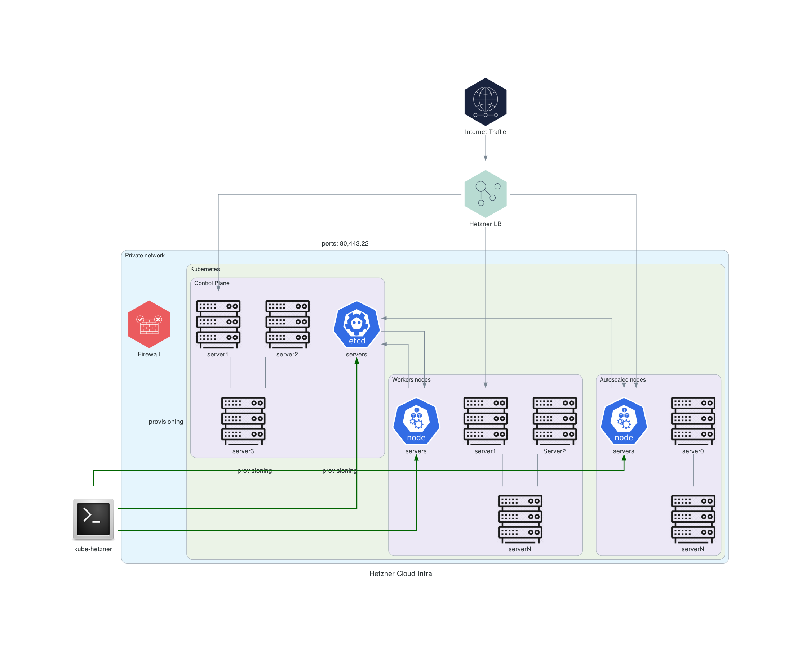
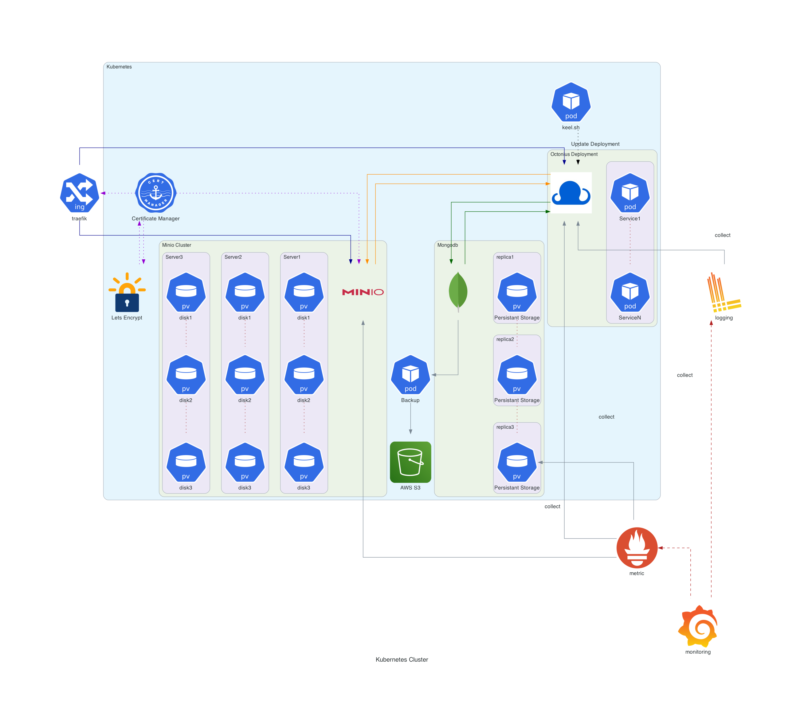

# Kubernetes Deployment


## Introduction

This guide outlines the configuration and operational details of the Kubernetes environment set up for Octonius Inc on Hetzner Cloud. Leveraging k3s for a lightweight Kubernetes distribution, this project facilitates a scalable, secure, and efficient platform for various applications and services.

## Project Structure

The project is structured into separate environments for production and acceptance, ensuring a robust deployment pipeline. Configuration files, Terraform scripts, and application manifests are organized as follows:

- `scripts/production/k8s`: Contains resources for the production environment, including Kubernetes manifests and Terraform scripts.
- `scripts/acceptance/k8s`: Similar structure for the acceptance environment, facilitating testing and validation before production deployment.

Each environment includes:

- **Applications** like MongoDB, MinIO, and the Octonius suite.
- **Monitoring tools** such as Prometheus, Grafana, and Loki for observability.
- **Backup solutions** for data resilience.

## Getting Started
### Prerequisites

Before you begin with deploying the stack using kube-hetzner, ensure you have the following prerequisites installed:

1. **Hetzner Cloud Account:** You will need a Hetzner Cloud account with appropriate permissions to create and manage cloud resources.

2. **CLI Tools:**
    - `kubectl`: Install `kubectl` to interact with Kubernetes clusters.
        - On macOS:
            ```bash
            brew install kubectl
            ```
        - On Linux or Windows:
        Follow the installation guide for `kubectl` [here](https://kubernetes.io/docs/reference/kubectl/overview/).

    - `terraform`: Install `terraform` to manage infrastructure as code.
        - On macOS:
            ```bash
            brew install terraform
            ```
        - On Linux or Windows:
        Refer to the installation instructions [here](https://www.terraform.io/downloads.html).

    - `packer`: Install `packer` for creating machine images.
        - On macOS:
            ```bash
            brew install packer
            ```
        - On Linux or Windows:
        Download and install `packer` from [here](https://www.packer.io/downloads).

    - `git-crypt`: Install `git-crypt` for encrypting sensitive information in the **kube-hetzner** folder.
        - On macOS:
            ```bash
            brew install git-crypt
            ```
        - On Windows (using `pacman`):
            ```bash
            pacman -S git-crypt
            ```
        - On Linux (using `apt-get`):
            ```bash
            apt-get install git-crypt
            ```

    - **Lens App:** Install the Lens app for managing Kubernetes clusters visually.
        - On macOS:
            ```bash
            brew install lens
            ```
        - On Linux or Windows: 
        Download and install Lens from [here](https://github.com/lensapp/lens/releases).

### Important: Unlocking git-crypt

Before you proceed with any further steps, it's crucial to unlock the `git-crypt` encryption on the **kube-hetzner** folder. This folder contains sensitive information and configurations required for this deployment. The decryption key for this folder should be requested from someone with access to the secrets.

Follow these steps to unlock `git-crypt`:

1. **Request the Decryption Key**: Contact a colleague or administrator who has access to the decryption key for the **kube-hetzner** folder.

2. **Unlock the Folder**: Once you have the decryption key, use the following command to unlock the folder:

    ```bash
    git-crypt unlock /path/to/key
    ```
Replace **/path/to/key** with the actual path to the decryption key file provided to you.

**Confirmation**: After successfully unlocking the folder, you will have access to the encrypted configurations and sensitive data required to proceed with your deployment.

>***Note***: Do not proceed with any further steps until you have successfully unlocked the kube-hetzner folder.

4. **Basic Knowledge:**
Ensure you have a basic understanding of Kubernetes and Terraform concepts.
Refer to the following resources for learning:
    - [kube-hetzner GitHub](https://github.com/kube-hetzner/terraform-hcloud-kube-hetzner)
    - [Kubernetes kubectl Reference](https://kubernetes.io/docs/reference/kubectl/quick-reference/)
    - [Terraform Cheat Sheet](https://justinoconnorcodes.files.wordpress.com/2021/09/terraform-cheatsheet-1.pdf)

With these prerequisites in place, you are ready to deploy and manage Kubernetes (**k8s**) deployment using kube-hetzner.

# Octonius App on Kubernetes

## Introduction

This guide will walk you through deploying and managing the Octonius app on a Kubernetes cluster. You can choose one of the following options:

1. Create a New Cluster:
    - [Create a New Cluster on Hetzner Cloud](#create-a-new-cluster)
    - [Create a New Cluster on different provider](#create-a-new-cluster-on-different-provider) 
2. [Install Octonius App Stack](#install-the-deployment)
3. [Manage Octonius App Stack](#update-the-deployments-components)

## Create a New Cluster

If you want to create a new Kubernetes cluster to run the Octonius app on **Hetzner Cloud**, follow these steps:

1. **Prerequisites**: Ensure you have the necessary prerequisites in place, including a Hetzner Cloud account.

2. **Hetzner Cloud Token**: Obtain your Hetzner Cloud API token and add it to the `hcloud_token` variable in the `kube.tf` configuration file.

3. **Cluster Configuration**: The `kube.tf` file is already configured for direct use with Hetzner Cloud. You can further customize your cluster by modifying the `agent_nodepools` and `control_plane_nodepools` variables. These variables define the pools for nodes in your cluster, allowing you to specify the size and characteristics of your worker nodes and control plane nodes.

4. **Terraform Deployment**: Use Terraform to create your Kubernetes cluster on Hetzner Cloud. Run the following commands:
    ```bash
    terraform init --upgrade
    terraform validate
    terraform apply -auto-approve
    ```
5. [Add your cluster to Lens](#adding-your-cluster-to-lens)    
## Create a New Cluster on different provider

Follow thesee steps to create k3s cluster

1. Deploy first master
    ```bash
    MYSECRET=secret
    curl -fL https://get.k3s.io | K3S_TOKEN=${MYSECRET} \
    sh -s - server --cluster-init
    ```
2. Get IP of first node
    ```bash
    root@x:~# k3s kubectl get nodes -o wide
    NAME       STATUS   ROLES                       AGE   VERSION        INTERNAL-IP      EXTERNAL-IP   OS-IMAGE             KERNEL-VERSION     CONTAINER-RUNTIME
    shredder   Ready    control-plane,etcd,master   83s   v1.21.5+k3s2   192.168.39.201   <none>        Ubuntu 20.04.3 LTS   5.4.0-70-generic   containerd://1.4.11-k3s1
    ```
> Oops! Did you mess something up? Just run k3s-uninstall.sh to wipe all traces of K3s, and start over!

3. Deploy other k3s master nodes (optional)
    ```bash
    MYSECRET=secret
    curl -fL https://get.k3s.io | K3S_TOKEN=${MYSECRET} \
    sh -s - server --disable servicelb --server https://<IP OF FIRST MASTER>:6443
    ```
    ```bash
    root@x:~# k3s kubectl get nodes
    NAME         STATUS   ROLES                       AGE     VERSION
    bebop        Ready    control-plane,etcd,master   4m13s   v1.21.5+k3s2
    rocksteady   Ready    control-plane,etcd,master   4m42s   v1.21.5+k3s2
    shredder     Ready    control-plane,etcd,master   8m54s   v1.21.5+k3s2
    ```
4. Deploy k3s worker nodes
    ```bash
    MYSECRET=secret
    curl -fL https://get.k3s.io | K3S_TOKEN=${MYSECRET} \
    K3S_URL=https://<IP OF FIRST MASTER>:6443 \
    sh -s -
    ```
> Oops! Did you mess something up? Just run k3s-agent-uninstall.sh to wipe all traces of K3s agent, and start over!

5. Copy `/etc/rancher/k3s/k3s.yaml` to to `~/.kube/config` or import it to [lens app](#adding-your-cluster-to-lens).

### Adding Your Cluster to Lens

Lens provides a convenient way to manage your Kubernetes clusters. To get started, you'll need to add your Hetzner Cloud Cluster to Lens. Follow these steps:

1. **Launch Lens**: Open the Lens application on your local machine.

2. **Dashboard Overview**: You'll be greeted with the Lens dashboard. If you're using Lens for the first time, it may appear empty.

3. **Add Cluster**: Click on the "Add Cluster" button, typically located at the top-left corner of the Lens dashboard.

4. **Select Cluster Type**: Choose "Kubernetes" as the cluster type. Lens supports various Kubernetes distributions.

5. **Cluster Configuration**:
   - Enter a name for your cluster. This can be any descriptive name to help you identify the cluster within Lens.
   - In the "Kubeconfig File" field, specify the path to your `k3s_kubeconfig.yaml` file for the Hetzner Cloud Cluster. This file contains the necessary configuration information to access your cluster.

6. **Advanced Options** (Optional): Lens provides advanced options like proxy settings. Configure these options if your cluster setup requires them.

7. **Connect**: Once you've provided the necessary information, click the "Connect" button.

8. **Cluster Added**: Lens will establish a connection to your Hetzner Cloud Cluster. Once successfully connected, you'll see your cluster listed in the Lens dashboard.

Now, your Hetzner Cloud Cluster is added to Lens, and you can start managing it using Lens' intuitive interface.

### Disconnecting from a Cluster

If you ever need to disconnect Lens from your cluster, follow these steps:

1. **Open Lens**: Launch the Lens application.

2. **Dashboard**: In the Lens dashboard, locate the cluster you want to disconnect from.

3. **Cluster Options**: Click on the cluster to select it. This will display additional options.

4. **Disconnect**: Among the options, you'll find a "Disconnect" option. Click on it to disconnect Lens from the cluster.

Adding your Hetzner Cloud Cluster to Lens provides an efficient way to manage and monitor your Kubernetes resources. 

For more detailed information about configuring, deploying, and maintaining applications on your cluster, you can explore the subsequent folders in your project's directory structure. Each folder contains specific resources, configurations, and documentation related to different aspects of your cluster and applications. .

# Octonius App stack


## Install the deployment

To install the app on a fresh cluster you need to navigate to each folder ***from 01 to 07***, which corresponds to different components of the stack, and follow the instructions provided in the Readme.md files within each folder to set up and configure the respective component. These instructions include modifying configuration files if necessary.

> Refrence: [Project Structure](#project-structure-1)

## Update the deployments components 
To update different components of the stack, head to the component respective folder edit the values file and apply the changes, all required commands are availalble in the components Readme.md file

> Refrence: [Project Structure](#project-structure-1)

## Project Structure

- **01_cert-manager**

    - [Readme.md](./kube-hetzner/apps/01_cert-manager/Readme.md): This file provides instructions and documentation for setting up and configuring Cert-Manager, a Kubernetes add-on for managing TLS certificates.
    - **cluster-issuer.yaml**: Configuration file for defining ClusterIssuers in Kubernetes, used to manage certificates.
    - **minio-certificate.yaml**: Configuration file for defining TLS certificates specific to Minio, an object storage server.
    minio-operator-ca-secret.yaml: Configuration file for defining a Secret resource that holds the CA (Certificate Authority) certificate for Minio.
    - **minio-self-signed.yaml**: Configuration file for defining a self-signed certificate for Minio, showcasing Cert-Manager's capabilities.

- **02_keel.sh**
    - [Readme.md](./kube-hetzner/apps/02_keel.sh/Readme.md): Documentation for using Keel, an automated Kubernetes deployment tool for updating container images.
    - **values.yaml**: Configuration file for Keel, specifying how to manage image updates.

- **03_mongodb**
    - [Readme.md](./kube-hetzner/apps/03_mongodb/Readme.md): Documentation for deploying and configuring MongoDB on Kubernetes.
    - **mongo-values.yml**: Configuration file for MongoDB Community Edition cluster deployment.

- **04_minio**
    - [Readme.md](./kube-hetzner/apps/04_minio/Readme.md): Information about Minio, an object storage server, and its usage within the project.

- **05_monitoring**
    - [Readme.md](./kube-hetzner/apps/05_monitoring/Readme.md): Documentation for setting up monitoring tools, including Loki, on Kubernetes.
    - **values-loki.yaml**: Configuration file for Grafana Loki stack deployment.
 
 - **06_octonius**
    - [README.md](./kube-hetzner/apps/06_octonius/README.md): Documentation for the Octonius application and its components.
    - **Chart.yaml**: Helm chart metadata for deploying the Octonius application.
    - **templates**: Contains various YAML templates for deploying Octonius microservices and server components.
    - **values.yaml**: Configuration file for customizing Octonius application deployment.

- **07_backup**
    - [Readme.md](./kube-hetzner/apps/07_backup/Readme.md): Documentation for backup procedures and configurations, specifically related to MongoDB backup on Kubernetes.
    - **deplyment.yaml**: Configuration file for managing backup procedures.